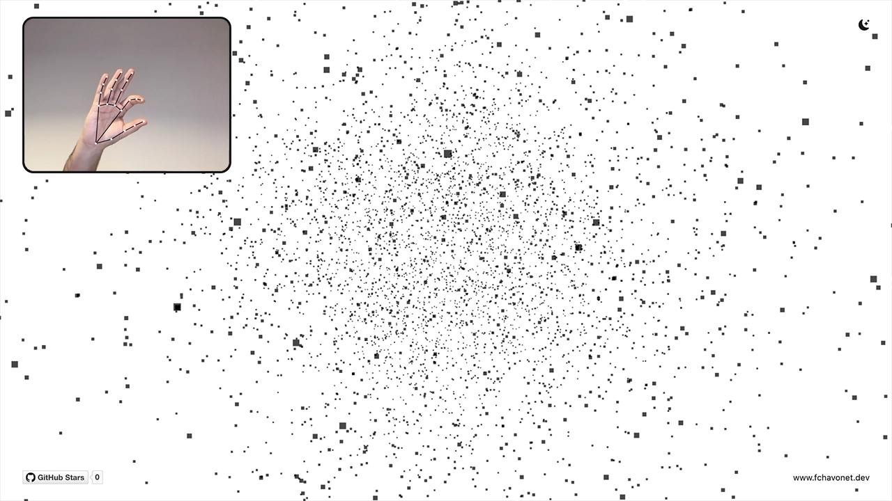

# Hand Particles

## Description

Hand Particles is an experimental web-based creative coding project that combines real-time hand tracking with a dynamic 3D particle system.

The project renders a spherical cloud of particles using Three.js, which reacts directly to hand gestures captured via the user’s webcam. By pinching fingers and moving the hand in space, the user can control both the explosion intensity and the rotation of the particle sphere.

The idea behind this project comes from an Instagram trend showcasing Gemini’s ability to generate interactive particle systems driven by hand movement. Inspired by this concept, the goal was to recreate a similar experience manually, as a developer, in order to fully understand the underlying technologies rather than relying on AI-generated results.

This project is primarily an exploration and learning experience, focused on real-time interaction, gesture recognition, and 3D visual feedback in the browser.

## Objectives

- Explore real-time hand tracking in the browser.
- Learn and integrate MediaPipe Hands for gesture recognition.
- Create an interactive particle system using Three.js.
- Link hand gestures to meaningful 3D transformations.
- Experiment with creative coding concepts and interaction design.

## Tech Stack


## File Description

| **FILE**     | **DESCRIPTION**                                                               |
| :----------: | ----------------------------------------------------------------------------- |
| `assets`     | Contains the resources required for the repository.                           |
| `index.html` | HTML structure and UI layout of the project.                                  |
| `style.css`  | Global styles, DaisyUI configuration, and visual tweaks.                      |
| `script.js`  | Core logic: Three.js scene, particle system, hand tracking, and interactions. |
| `README.md`  | The README file you are currently reading 😉.                                 |

## Installation & Usage

### Installation

1. Clone this repository:
    - Open your preferred Terminal.
    - Navigate to the directory where you want to clone the repository.
    - Run the following command:

```
git clone https://github.com/fchavonet/creative_coding-hand_particles.git
```

2. Open the cloned repository.

### Usage

1. Open the `index.html` file in your web browser.

2. Allow camera access when prompted (required for hand tracking).

3. Interact with the experience:
    - Use a pinch gesture (thumb + index) to control the particle explosion.
    - Move your hand to rotate the particle sphere in 3D space.

You can also test the project online by clicking [here](https://fchavonet.github.io/creative_coding-hand_particles/).

<p align="center">
    <picture>
        <source media="(prefers-color-scheme: light)" srcset="./assets/images/screenshots/desktop_page_screenshot-light.webp">
        <source media="(prefers-color-scheme: dark)" srcset="./assets/images/screenshots/desktop_page_screenshot-dark.webp">
        
    </picture>
</p>

## What's Next?

- Improve gesture precision and smoothing.
- Add configurable interaction parameters.

## Thanks

- A big thank you to my friends Pierre and Yoann, always available to test and provide feedback on my projects.

## Author(s)

**Fabien CHAVONET**
- GitHub: [@fchavonet](https://github.com/fchavonet)
